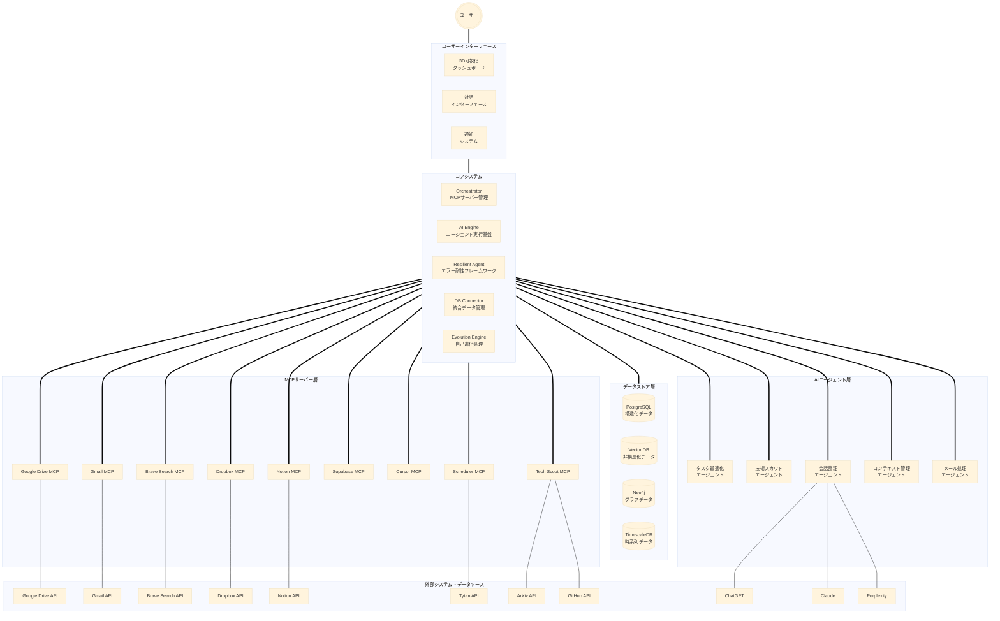
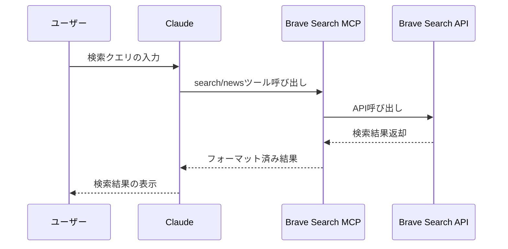
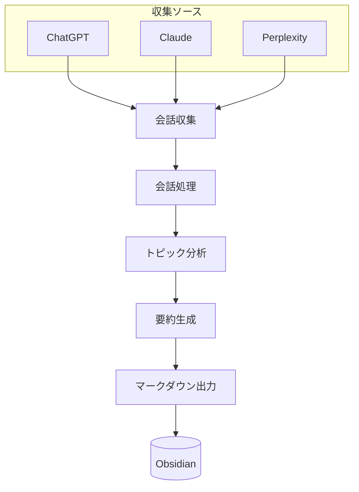
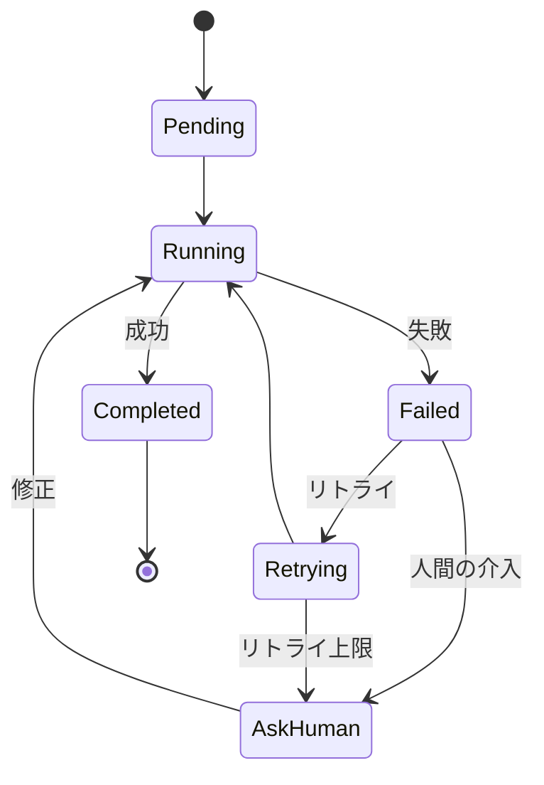

# STAR-MCP プロジェクト基準書 V4

## プロジェクト概要
STAR-MCPは、ユーザーの分身として機能する自己進化型MCPエコシステムです。データ駆動による意思決定支援と自動化に加え、技術スカウティング、タスク最適化、3D可視化による直感的な情報探索を実現します。V4では会話整理エージェントとレジリエントエージェントフレームワークを追加し、より堅牢で自律的なエコシステムを構築します。

## ディレクトリ構成基準

```
STAR-MCP/
├── interface/                  # ユーザーインターフェース層
│   ├── dashboard/             # 3D可視化ダッシュボード
│   │   ├── neo4j-3d-viewer/   # Neo4j 3D可視化
│   │   └── knowledge-map/     # ナレッジマップ
│   ├── chat/                  # チャットインターフェース
│   └── notification/          # 通知システム
│
├── core/                       # コアシステム
│   ├── orchestrator/          # MCPサーバー管理・制御
│   ├── db-connector/          # データベース統合層
│   ├── ai-engine/             # AI実行エンジン
│   ├── resilient-agent/       # 回復力のあるエージェントフレームワーク
│   │   ├── error-handler.ts   # エラー処理モジュール
│   │   ├── task-manager.ts    # タスク管理モジュール
│   │   ├── logger.ts          # ログ記録モジュール
│   │   └── types.ts           # 型定義
│   └── evolution-engine/      # 自己進化エンジン
│       ├── learning/          # 学習最適化
│       └── adaptation/        # 環境適応
│
├── servers/                    # MCPサーバー群
│   ├── gdrive/                # Google Drive統合
│   ├── gmail/                 # Gmail統合
│   ├── brave-search/          # インターネット検索
│   │   ├── index.ts           # サーバーエントリーポイント
│   │   └── fetch.ts           # API通信モジュール
│   ├── dropbox/               # Dropbox統合
│   ├── notion/                # Notion統合
│   ├── supabase/              # Supabase統合
│   └── templates/             # 新規サーバー用テンプレート
│
├── agents/                    # AIエージェント
│   ├── task-optimizer/        # タスク最適化
│   │   ├── quantum-annealing/ # 量子アニーリング処理
│   │   └── schedule-optimizer/# スケジュール最適化
│   ├── tech-scout/           # 技術情報収集・分析
│   │   ├── trend-analyzer/   # トレンド分析
│   │   ├── poc-manager/     # PoC検証管理
│   │   └── impact-evaluator/ # 影響度評価
│   ├── conversation-organizer/ # 会話整理エージェント
│   │   ├── collectors/       # 会話収集モジュール
│   │   ├── processors/       # 会話処理モジュール
│   │   └── output/           # 出力フォーマッター
│   ├── context-manager/      # コンテキスト管理
│   ├── email-assistant/      # メール処理アシスタント
│   │   ├── categorizer/      # メール分類
│   │   ├── responder/        # 自動応答
│   │   └── scheduler/        # 予定抽出・登録
│   └── templates/            # 新規エージェント用テンプレート
│
└── shared/                   # 共有リソース
    ├── schemas/             # データスキーマ定義
    ├── utils/               # 共通ユーティリティ
    └── config/              # 設定ファイル
```

## システム構成図



## 主要コンポーネント

### 1. Brave Search MCP
- **インターネット検索**
  - ウェブ検索機能
  - ニュース検索機能
  - API連携
  - 結果フォーマット

- **MCPツール**
  - `search`: ウェブ検索
  - `news`: ニュース検索

### 2. 会話整理エージェント
- **会話収集機能**
  - ChatGPT会話収集
  - Claude会話収集
  - Perplexity会話収集
  - ブラウザ自動操作
  - ログファイル読み込み

- **会話処理機能**
  - トピック検出
  - 会話要約生成
  - トピックグループ化

- **出力機能**
  - マークダウン出力
  - Obsidian統合
  - 相互リンク生成

### 3. レジリエントエージェントフレームワーク
- **エラーハンドリング**
  - エラーパターン認識
  - 自動リトライ
  - フォールバック戦略
  - エラー記録

- **タスク管理**
  - タスク定義と実行
  - 依存関係管理
  - 実行状態監視
  - 一時停止と再開

- **柔軟な設定**
  - 戦略カスタマイズ
  - ログレベル調整
  - タイムアウト設定

### 4. Gmail MCP
- **メールデータアクセス**
  - Gmail APIを使用したメールデータ取得
  - ラベル、スレッド、添付ファイル管理
  - 検索・フィルタリング機能

- **メールコンテキスト統合**
  - メールからのコンテキスト抽出
  - タスク・予定の自動識別
  - コミュニケーション履歴の統合管理

## データモデル定義

### schemas/conversation-data.json
```json
{
  "conversations": [
    {
      "id": "conv-123",
      "source": "chatgpt",
      "title": "TypeScriptについての質問",
      "url": "https://chat.openai.com/c/123",
      "content": "User: TypeScriptの型定義について質問があります...\nAssistant: TypeScriptの型定義は...",
      "date": "2025-02-20T15:30:00Z",
      "topics": ["TypeScript", "プログラミング"],
      "summary": "TypeScriptの型定義とジェネリクスに関する質問と回答"
    }
  ],
  "topics": [
    {
      "name": "TypeScript",
      "conversationIds": ["conv-123", "conv-456"],
      "relatedTopics": ["JavaScript", "プログラミング"]
    }
  ]
}
```

### schemas/resilient-agent-task.json
```json
{
  "tasks": [
    {
      "name": "read-file",
      "description": "ファイルの読み込み",
      "status": "completed",
      "startTime": "2025-02-26T10:00:00Z",
      "endTime": "2025-02-26T10:00:05Z",
      "result": {
        "success": true,
        "data": "ファイルの内容..."
      },
      "retryCount": 0,
      "dependencies": []
    }
  ],
  "errorRecords": [
    {
      "id": "error-123",
      "timestamp": "2025-02-26T10:15:00Z",
      "taskName": "process-data",
      "errorType": "network",
      "message": "タイムアウトエラーが発生しました",
      "resolution": "リトライ成功",
      "resolved": true
    }
  ]
}
```

## 実装フロー

### Brave Search MCPの実装フロー



### 会話整理エージェントの処理フロー



### レジリエントエージェントの実行フロー



## デプロイメント計画

### フェーズ1: 基盤整備（完了）
- 基本ディレクトリ構造の作成
- プロジェクト基準書の策定
- MCPサーバー基本実装

### フェーズ2: コア機能実装（進行中）
- Brave Search MCP実装
- 会話整理エージェント実装
- レジリエントエージェントフレームワーク実装
- Gmail MCP設計

### フェーズ3: 機能統合と最適化
- Obsidian・Notion知識ベース統合
- データベース連携
- ユーザーインターフェース実装
- エージェント間連携

### フェーズ4: 自己進化システム実装
- パターン認識機能
- 自動改善プロセス
- フィードバックループの確立
- 拡張機能開発

## セキュリティとプライバシー

- APIキーの安全な保管
- 認証情報の適切な管理
- データ暗号化の適用
- ローカル優先の処理
- 個人情報の保護

## 次のステップ

1. 各MCPサーバーのビルドとテスト
2. API認証情報の設定
3. Claudeデスクトップとの統合テスト
4. 実用的なエージェントの実装
5. データ統合レイヤーの拡張
6. ユーザーインターフェースのプロトタイプ開発

## 更新履歴
- 2025-02-26: V4としてBrave Search MCP、会話整理エージェント、レジリエントエージェントフレームワークの追加
- 2025-02-25: Gmail MCPの構想と設計を追加（V3）
- 2025-02-24: プロジェクト構造とTypeScript規約を更新（V2）
- 2025-02-19: 初版作成（V1）
