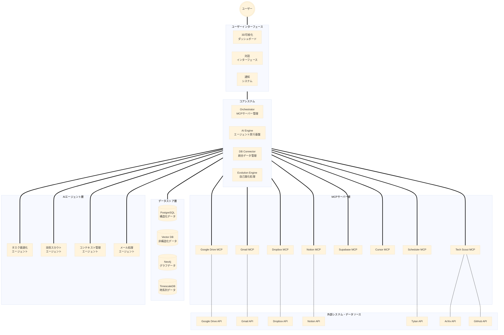
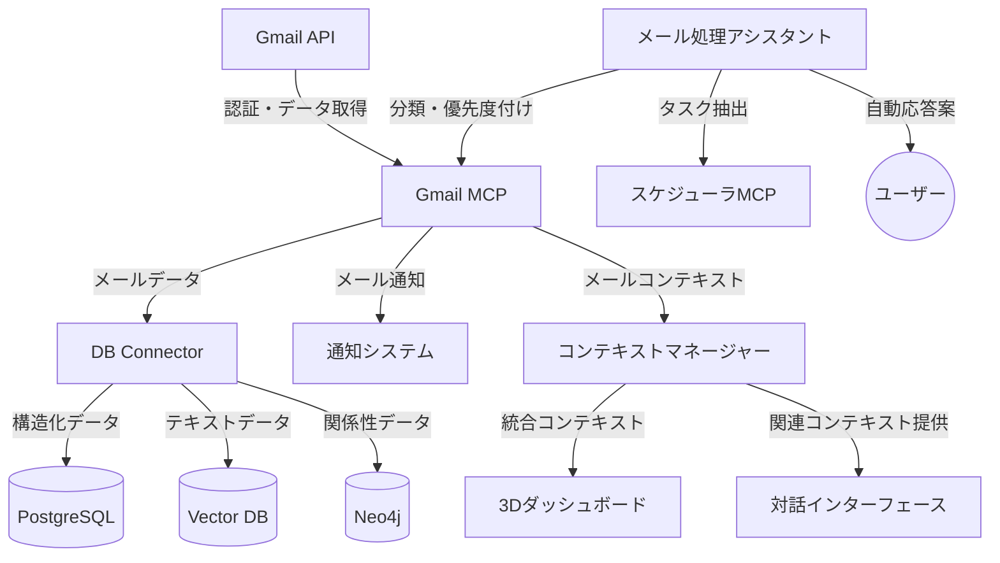

# STAR-MCP プロジェクト基準書 V3

## プロジェクト概要
STAR-MCPは、ユーザーの分身として機能する自己進化型MCPエコシステムです。データ駆動による意思決定支援と自動化に加え、技術スカウティング、量子アニーリングによる最適化、3D可視化による直感的な情報探索を実現します。V3では新たにGmail統合を追加し、メール関連のデータをスター型アーキテクチャに組み込みます。

## ディレクトリ構成基準

```
STAR-MCP/
├── interface/                  # ユーザーインターフェース層
│   ├── dashboard/             # 3D可視化ダッシュボード
│   │   ├── neo4j-3d-viewer/   # Neo4j 3D可視化
│   │   └── knowledge-map/     # ナレッジマップ
│   ├── chat/                  # チャットインターフェース
│   └── notification/          # 通知システム
│
├── core/                       # コアシステム
│   ├── orchestrator/          # MCPサーバー管理・制御
│   ├── db-connector/          # データベース統合層
│   ├── ai-engine/             # AI実行エンジン
│   └── evolution-engine/      # 自己進化エンジン
│       ├── learning/          # 学習最適化
│       └── adaptation/        # 環境適応
│
├── servers/                    # MCPサーバー群
│   ├── gdrive/                # Google Drive統合
│   ├── gmail/                 # Gmail統合 (新規追加)
│   ├── dropbox/               # Dropbox統合
│   ├── notion/                # Notion統合
│   ├── supabase/              # Supabase統合
│   └── templates/             # 新規サーバー用テンプレート
│
├── agents/                    # AIエージェント
│   ├── task-optimizer/        # Tytan活用タスク最適化
│   │   ├── quantum-annealing/ # 量子アニーリング処理
│   │   └── schedule-optimizer/# スケジュール最適化
│   ├── tech-scout/           # 技術情報収集・分析
│   │   ├── trend-analyzer/   # トレンド分析
│   │   ├── poc-manager/     # PoC検証管理
│   │   └── impact-evaluator/ # 影響度評価
│   ├── context-manager/      # コンテキスト管理
│   ├── email-assistant/      # メール処理アシスタント (新規追加)
│   │   ├── categorizer/      # メール分類
│   │   ├── responder/        # 自動応答
│   │   └── scheduler/        # 予定抽出・登録
│   └── templates/            # 新規エージェント用テンプレート
│
└── shared/                   # 共有リソース
    ├── schemas/             # データスキーマ定義
    ├── utils/               # 共通ユーティリティ
    └── config/              # 設定ファイル
```

## システム構成図



## 追加された主要コンポーネント (V3)

### 1. Gmail MCP
- **メールデータアクセス**
  - Gmail APIを使用したメールデータ取得
  - ラベル、スレッド、添付ファイル管理
  - 検索・フィルタリング機能

- **メールコンテキスト統合**
  - メールからのコンテキスト抽出
  - タスク・予定の自動識別
  - コミュニケーション履歴の統合管理

### 2. メール処理アシスタント
- **メール分類システム**
  - LLMによる自動カテゴリ分類
  - 優先度評価
  - アクション必要性の判断

- **自動応答システム**
  - テンプレート応答生成
  - コンテキスト考慮型返信案
  - フォローアップリマインダー

- **スケジュール連携**
  - メールからの予定抽出
  - カレンダー自動登録
  - Scheduler MCPとの連携

### 3. ユーザーインターフェース拡張
- **メール可視化**
  - メールグラフ表示
  - コミュニケーションネットワーク分析
  - 重要度ヒートマップ

- **統合ダッシュボード**
  - メール、ドキュメント、タスクの統合ビュー
  - スライディングタイムライン表示
  - クロスサービスコンテキスト探索

## データモデル拡張 (V3)

### schema/email-data.json
```json
{
  "emails": [
    {
      "id": "email-123",
      "threadId": "thread-456",
      "from": "sender@example.com",
      "to": ["recipient@example.com"],
      "cc": ["cc@example.com"],
      "subject": "プロジェクト進捗について",
      "receivedAt": "2025-03-01T10:30:00Z",
      "labels": ["プロジェクトA", "重要"],
      "hasAttachments": true,
      "attachments": [
        {
          "id": "att-789",
          "filename": "progress-report.pdf",
          "mimeType": "application/pdf",
          "size": 2457890
        }
      ],
      "bodySnippet": "先週の進捗報告をお送りします...",
      "isRead": true,
      "priority": 8,
      "actionRequired": true,
      "actionDeadline": "2025-03-03T17:00:00Z",
      "responseStatus": "pending"
    }
  ],
  "threads": [
    {
      "id": "thread-456",
      "subject": "プロジェクト進捗について",
      "participants": ["sender@example.com", "recipient@example.com", "cc@example.com"],
      "messageCount": 5,
      "lastUpdatedAt": "2025-03-01T15:45:00Z",
      "isCompleted": false,
      "contextSummary": "プロジェクトAの週次進捗報告と次週の計画に関するスレッド"
    }
  ],
  "contacts": [
    {
      "email": "sender@example.com",
      "name": "John Doe",
      "organization": "Example Corp",
      "category": "work",
      "responseTimeAvg": 86400,
      "lastContactedAt": "2025-03-01T10:30:00Z",
      "importance": 9
    }
  ]
}
```

### schema/email-tasks.json
```json
{
  "emailTasks": [
    {
      "id": "etask-123",
      "emailId": "email-123",
      "title": "進捗報告書レビュー",
      "description": "John Doeからの進捗報告書をレビューして返信する",
      "extractedDeadline": "2025-03-03T17:00:00Z",
      "estimatedDuration": 30,
      "priority": 7,
      "status": "pending",
      "scheduledFor": "2025-03-02T14:00:00Z",
      "linkedCalendarEvent": "event-xyz",
      "responseTemplate": "template-review-feedback"
    }
  ],
  "responseTemplates": [
    {
      "id": "template-review-feedback",
      "name": "レビューフィードバック",
      "content": "{{送信者名}}様\n\nご送付いただいた{{文書名}}を確認しました。以下のフィードバックをお送りします：\n\n{{フィードバック内容}}\n\nご質問があればお知らせください。\n\n{{自分の名前}}",
      "usage": "document-review",
      "lastUsed": "2025-02-28T09:15:00Z",
      "successRate": 0.92
    }
  ]
}
```

## Gmail MCPの統合フロー



## Gmail MCP技術仕様

### 機能要件

1. **認証・アクセス管理**
   - OAuth 2.0認証によるGmail APIアクセス
   - トークンリフレッシュ機構
   - スコープ制限と安全なトークン保存

2. **メールデータ処理**
   - フィルタリングとページング
   - HTMLからプレーンテキスト変換
   - 添付ファイル処理とストレージ

3. **インデックス作成**
   - メール本文のベクトル化
   - メタデータインデックス
   - 全文検索インデックス

4. **非同期更新**
   - Pub/Sub通知による差分更新
   - プッシュ通知サポート
   - バックグラウンド同期

### 拡張性設計

1. **ラベルとフォルダ同期**
   - Gmailラベル構造の反映
   - カスタムラベル管理
   - ラベルベースのコンテキスト分離

2. **検索API**
   - 高度な検索クエリ構文
   - セマンティック検索
   - 関連メール検索

3. **ルールエンジン**
   - カスタムルールによる処理自動化
   - イベントトリガー
   - スケジュール処理

## 既存システムとの統合

### Google Drive MCPとの連携
- 認証共有メカニズム
- 添付ファイルとドキュメントの相互参照
- 共通メタデータスキーマの拡張

### スケジューラMCPとの連携
- メールから抽出したタスク・予定の最適スケジューリング
- カレンダー連携
- タスクの優先度付けへのメールコンテキスト活用

### コンテキストマネージャーとの連携
- メールスレッドのグラフベース表現
- プロジェクトやトピックごとのメール・ドキュメント統合
- マルチモーダルコンテキスト構築

## デプロイメント計画

### フェーズ1: 基本機能の実装
- Gmail API認証とデータ取得
- 基本メタデータの保存
- MCPサーバー基本構造実装

### フェーズ2: データ統合とコンテキスト化
- データベースへの統合
- ベクトル化と検索機能
- グラフデータベース連携

### フェーズ3: AIアシスタント機能
- メール分類と優先度付け
- レスポンステンプレート生成
- タスク抽出とスケジューリング

### フェーズ4: UI統合と可視化
- 3Dダッシュボードへのメールデータ統合
- メール関係グラフの可視化
- 統合検索インターフェース

## セキュリティとプライバシー

- アクセストークンの安全な保存
- 機密データの暗号化
- オンデマンドデータアクセスモデル
- ローカルデータ処理優先

## 次のステップ

1. Gmail MCP基本サーバー実装の開始
2. Google認証共有機構の実装
3. メールデータスキーマの詳細設計
4. データベース統合レイヤーの拡張
5. AIアシスタントのプロトタイプ開発
