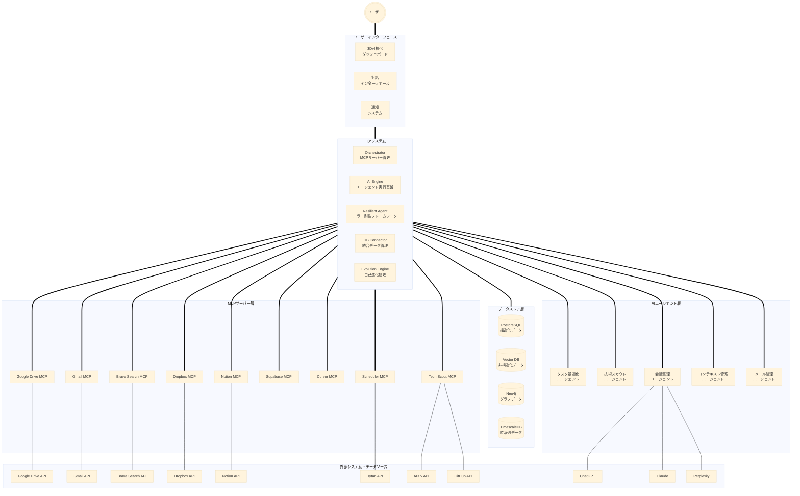

# STAR-MCP エコシステム

STAR-MCP（Specialized Tools and Applications for Reliable Model Context Protocol）は、建築業界向けに特化されたAIエージェント組織を構築するエコシステムです。MCPサーバーを通じて、AIに多様なデータソースとツールへのアクセスを提供します。

## 概要

STAR-MCPは以下の目標を持っています：

- 建築業界の作業フローを効率化するAIエージェントの提供
- 多様なデータソースへの統一されたアクセス
- LLMと連携したワークフローの自動化
- AIの適応性と信頼性の向上

## システム構成図（エコマップ）

STAR-MCPエコシステムの最終目標となるシステム構成図です。
このエコシステムは、ユーザーインターフェース層、コアシステム層、データストア層、MCPサーバー層、AIエージェント層、外部システム層から構成されています。

## コンポーネント

STAR-MCPエコシステムは以下のコンポーネントで構成されています：

### コアシステム

- **STAR-MCP Core**: エコシステム全体を管理するコアサーバー
- **共有データレイヤー**: MCPサーバー間でデータを共有するための中央リポジトリ
- **レジリエントエージェントフレームワーク**: エラー耐性と自動リカバリー機能を提供
- **AI実行エンジン**: エージェントの実行と管理を担当

### 統合されたMCPサーバー

- **ファイルシステム**: ローカルファイルへのアクセス
- **Google Drive**: クラウドストレージとの統合
- **Brave Search**: ウェブ検索機能
- **Obsidian**: ナレッジベースへのアクセス
- **Notion**: プロジェクト管理ツールとの統合
- **Gmail**: メール管理とタスク抽出
- **Dropbox**: ファイル共有との統合
- **Supabase**: データベース接続

### AIエージェント

- **会話整理エージェント**: AI会話履歴の整理と要約
- **タスク最適化エージェント**: 優先順位付けとスケジューリング
- **テックスカウトエージェント**: 新技術のモニタリングと評価
- **コンテキスト管理エージェント**: 会話コンテキストの最適化
- **メール処理アシスタント**: メールの分類と応答支援

## セットアップ

詳細なセットアップ手順については、[SETUP_GUIDE.md](./SETUP_GUIDE.md)を参照してください。

基本的な手順:

1. リポジトリのクローン
2. 依存関係のインストール: `./install-deps.bat`
3. Claude Desktopの設定: `claude_desktop_config.json`を適切な場所にコピー
4. Claude Desktopの再起動

## 使用方法

STAR-MCPエコシステムは、Claude Desktopと統合して使用します。セットアップが完了すると、Claude Desktopから以下の機能にアクセスできます：

- ローカルファイルの検索と読み取り
- ウェブ検索の実行
- Obsidianボールトからの情報取得
- STAR-MCPのシステム情報とステータスの確認

## 開発

STAR-MCPエコシステムへの貢献を歓迎します。開発には以下のツールが必要です：

- Node.js 18以上
- TypeScript
- npm or yarn

詳細については、[CONTRIBUTING.md](./CONTRIBUTING.md)を参照してください。

## ステータス

このプロジェクトはまだ開発中であり、一部の機能は未実装または不安定です。進捗状況は[progress.md](./progress.md)で確認できます。

## ライセンス

MIT

## 連絡先

質問や提案がある場合は、Issues機能を使用してください。
