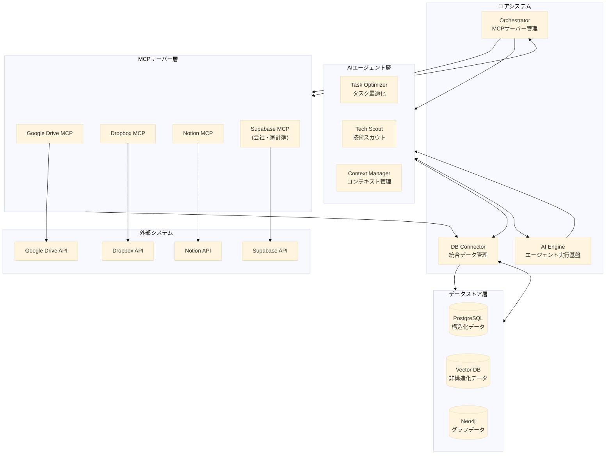

# STAR-MCP プロジェクト基準書

## プロジェクト概要
STAR-MCPは、中央データストアを中心とした統合型MCPエコシステムです。各種データソース、AIエージェント、ツールを効率的に連携させ、データ駆動型の意思決定と自動化を実現します。

## ディレクトリ構成基準

```
STAR-MCP/
├── core/                       # コアシステム
│   ├── orchestrator/          # MCPサーバー管理・制御
│   │   ├── server-manager/    # サーバーライフサイクル管理
│   │   ├── health-monitor/    # ヘルスチェック・監視
│   │   └── resource-manager/  # リソース割り当て管理
│   ├── db-connector/          # データベース統合層
│   │   ├── postgres/          # PostgreSQL接続管理
│   │   ├── vector-db/         # ベクターDB接続管理
│   │   └── neo4j/             # グラフDB接続管理
│   └── ai-engine/             # AI実行エンジン
│       ├── llm-manager/       # LLMインテグレーション
│       ├── agent-runtime/     # エージェント実行環境
│       └── feedback-system/   # 学習・フィードバック処理
│
├── servers/                    # MCPサーバー群
│   ├── gdrive/                # Google Drive連携
│   ├── dropbox/               # Dropbox連携
│   ├── notion/                # Notion連携
│   ├── supabase/              # Supabase連携（会社・家計簿）
│   └── templates/             # 新規サーバー用テンプレート
│
├── agents/                    # AIエージェント
│   ├── task-optimizer/        # タスク最適化
│   ├── tech-scout/           # 技術情報収集・分析
│   ├── context-manager/      # コンテキスト管理
│   └── templates/            # 新規エージェント用テンプレート
│
└── shared/                   # 共有リソース
    ├── schemas/             # データスキーマ定義
    │   ├── db/             # データベーススキーマ
    │   └── api/            # API定義
    ├── utils/              # 共通ユーティリティ
    │   ├── logging/        # ログ管理
    │   └── security/       # セキュリティ機能
    └── config/             # 設定ファイル
        ├── dev/            # 開発環境設定
        └── prod/          # 本番環境設定

```

## システム構成図



## 開発ガイドライン

### 1. MCPサーバー開発基準
- サーバーは`servers`ディレクトリ内に配置
- テンプレートをベースに開発
- 統一された命名規則に従う
- Orchestratorとの連携を必須とする

### 2. エージェント開発基準
- エージェントは`agents`ディレクトリ内に配置
- AI Engineとの連携を必須とする
- 明確な責務と目的を定義
- フィードバックループを実装

### 3. コア開発基準
- モジュール間の疎結合を維持
- 拡張性を考慮した設計
- 監視・ログ機能を標準実装
- セキュリティを優先事項とする

### 4. 共有リソース管理
- スキーマの一元管理
- 設定ファイルのバージョン管理
- 共通ユーティリティの再利用促進
- ドキュメント更新の徹底

## セキュリティ基準
1. 認証・認可の統一管理
2. データの暗号化
3. アクセスログの取得
4. 定期的なセキュリティ監査

## 品質管理基準
1. ユニットテストの必須化
2. 統合テストの自動化
3. パフォーマンス指標の設定
4. 定期的なコードレビュー

## バージョン管理基準
1. セマンティックバージョニングの採用
2. ブランチ戦略の統一
3. コミットメッセージの規約
4. リリースノートの作成

## 今後の展開
1. リモートMCP対応
2. コンテナ化対応
3. マルチクラウド展開
4. AIエージェントの拡充
