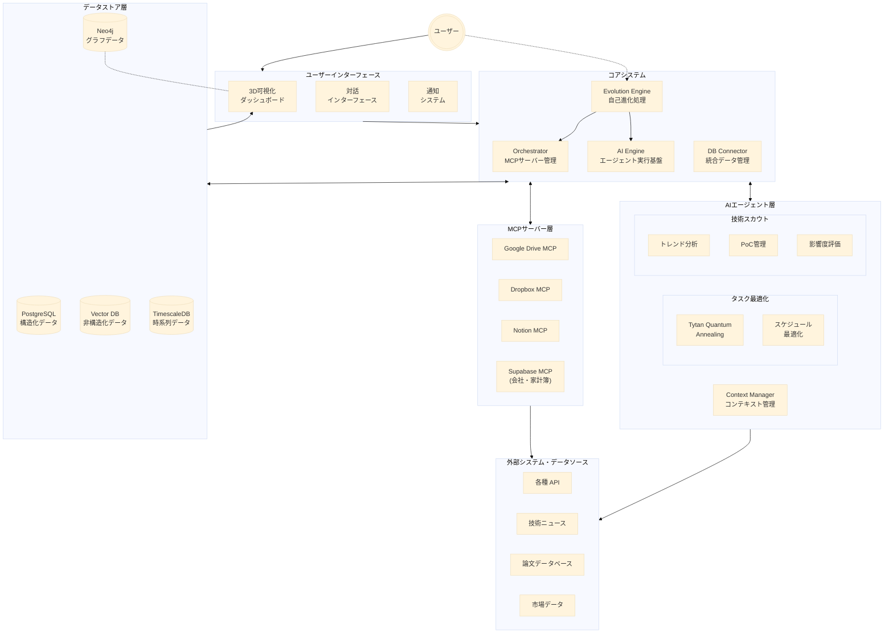

# STAR-MCP プロジェクト基準書 V2

## プロジェクト概要
STAR-MCPは、ユーザーの分身として機能する自己進化型MCPエコシステムです。データ駆動による意思決定支援と自動化に加え、技術スカウティング、量子アニーリングによる最適化、3D可視化による直感的な情報探索を実現します。

## ディレクトリ構成基準

```
STAR-MCP/
├── interface/                  # ユーザーインターフェース層
│   ├── dashboard/             # 3D可視化ダッシュボード
│   │   ├── neo4j-3d-viewer/   # Neo4j 3D可視化
│   │   └── knowledge-map/     # ナレッジマップ
│   ├── chat/                  # チャットインターフェース
│   └── notification/          # 通知システム
│
├── core/                       # コアシステム
│   ├── orchestrator/          # MCPサーバー管理・制御
│   ├── db-connector/          # データベース統合層
│   ├── ai-engine/             # AI実行エンジン
│   └── evolution-engine/      # 自己進化エンジン
│       ├── learning/          # 学習最適化
│       └── adaptation/        # 環境適応
│
├── servers/                    # MCPサーバー群
│   ├── gdrive/
│   ├── dropbox/
│   ├── notion/
│   ├── supabase/
│   └── templates/
│
├── agents/                    # AIエージェント
│   ├── task-optimizer/        # Tytan活用タスク最適化
│   │   ├── quantum-annealing/ # 量子アニーリング処理
│   │   └── schedule-optimizer/# スケジュール最適化
│   ├── tech-scout/           # 技術情報収集・分析
│   │   ├── trend-analyzer/   # トレンド分析
│   │   ├── poc-manager/     # PoC検証管理
│   │   └── impact-evaluator/ # 影響度評価
│   ├── context-manager/      # コンテキスト管理
│   └── templates/            # 新規エージェント用テンプレート
│
└── shared/                   # 共有リソース
    ├── schemas/             
    ├── utils/              
    └── config/             
```

## システム構成図



## 追加された主要コンポーネント

### 1. ユーザーインターフェース層
- **3D可視化ダッシュボード**
  - Neo4j 3D Force Graphを活用
  - WebGLベースの対話的可視化
  - ナレッジマップのリアルタイム表示

### 2. 進化エンジン
- **学習最適化**
  - ユーザー行動パターンの学習
  - インタラクション履歴の分析
  - システム応答の最適化

- **環境適応**
  - 技術トレンドへの追従
  - リソース使用の自動調整
  - パフォーマンス最適化

### 3. Tytanによる最適化
- スケジューリング問題の量子アニーリング処理
- リソース割り当ての最適化
- 制約充足問題の解決

### 4. 技術スカウトの強化
- **トレンド分析**
  - 技術記事・論文の自動収集
  - 影響度評価
  - 採用可能性の判断

- **PoC管理**
  - 検証環境の自動構築
  - 結果の自動評価
  - レポート生成

## データ可視化ガイドライン

### 1. 3D可視化基準
- Neo4j 3D Force Graphの活用
- WebGLによるパフォーマンス最適化
- インタラクティブな操作性の確保

### 2. 情報構造化基準
- グラフデータモデルの設計
- 関係性の視覚的表現
- 階層構造の表現方法

### 3. UX設計基準
- 直感的なナビゲーション
- フィルタリング機能
- 検索・絞り込み機能

## 進化プロセス管理

### 1. パフォーマンス計測
- レスポンス時間
- 精度評価
- リソース使用効率

### 2. 適応評価
- ユーザーフィードバック分析
- 環境変化への対応度
- 技術採用の適切性

### 3. 継続的改善
- 定期的な性能評価
- 新技術の統合計画
- システム拡張方針
