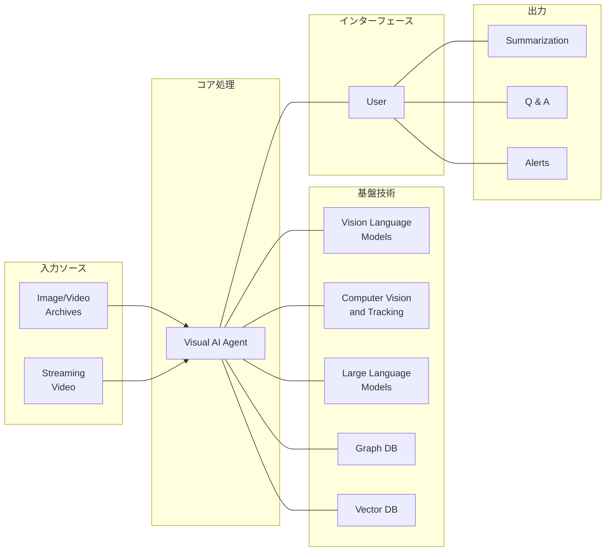
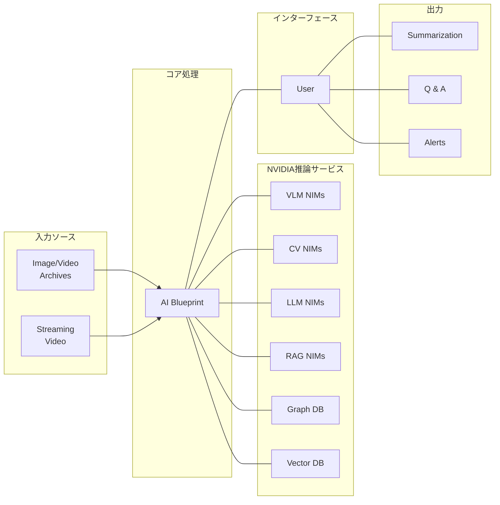

# NVIDIAのビデオ分析AIエージェントエコシステム解説

## 画像1: Video Analytics AI Agents – an Entirely New Class of Applications

### 概要
この画像は、カメラストリームやアーカイブ動画から知識やインサイトを引き出すための新しいアプリケーションクラスとしての「ビデオ分析AIエージェント」の概念を示しています。

### 主要コンポーネント

#### 1. 入力ソース
- **Image/Video Archives**: 既存の画像や動画のアーカイブデータ
- **Streaming Video**: リアルタイムで流れるカメラの映像ストリーム

#### 2. Visual AI Agent (視覚AIエージェント)
中央に位置する主要コンポーネントで、ユーザーからの指示を受け、ビデオデータを分析し、必要なインサイトを抽出・提供します。

#### 3. 基盤技術
Visual AI Agentを支える技術要素：
- **Vision Language Models**: 画像や動画を理解し、自然言語と組み合わせて処理するモデル
- **Computer Vision and Tracking**: 物体検出や追跡などの視覚認識技術
- **Large Language Models**: テキスト生成や理解を行う大規模言語モデル
- **Graph DB**: 関係性を格納・分析するグラフデータベース
- **Vector DB**: 画像や言語の意味的表現を格納するベクトルデータベース

#### 4. ユーザーインターフェースとアウトプット
- **User**: システムとやり取りするエンドユーザー
- **アウトプット形式**:
  - **Summarization**: 動画コンテンツの要約
  - **Q&A**: 動画内容に関する質問応答
  - **Alerts**: 特定のイベントや状況の検出時のアラート

### エコシステムマップ (Mermaid図)

## 画像2: NVIDIA AI Blueprint For Video Search and Summarization (VSS)

### 概要
この画像は、ビデオ分析AIエージェントを構築するための開発プラットフォームである「NVIDIA AI Blueprint for VSS」を示しています。これは具体的な実装技術やサービスについて詳細に言及しています。

### 主要コンポーネント

#### 1. 入力ソース
- **Image/Video Archives**: 既存の画像や動画のアーカイブデータ
- **Streaming Video**: リアルタイムで流れるカメラの映像ストリーム

#### 2. AI Blueprint
中央の主要コンポーネントで、ビデオ分析のためのNVIDIAの統合フレームワーク。

#### 3. 基盤技術（NIMs = NVIDIA Inference Microservices）
- **VLM NIMs**: Vision Language Model（視覚言語モデル）の推論マイクロサービス
- **CV NIMs**: Computer Vision（コンピュータビジョン）の推論マイクロサービス
- **LLM NIMs**: Large Language Model（大規模言語モデル）の推論マイクロサービス
- **RAG NIMs**: Retrieval Augmented Generation（検索拡張生成）の推論マイクロサービス
- **Graph DB**: 関係性データの格納・分析
- **Vector DB**: ベクトル形式でのデータ格納・検索

#### 4. ユーザーインターフェースとアウトプット
- **User**: システムとやり取りするエンドユーザー
- **アウトプット形式**:
  - **Summarization**: 動画コンテンツの要約
  - **Q&A**: 動画内容に関する質問応答
  - **Alerts**: 特定のイベントや状況の検出時のアラート

### エコシステムマップ (Mermaid図)

## 両エコシステムの違いと特徴

1. **焦点の違い**:
   - 画像1: より概念的で、ビデオ分析AIエージェントという「新しいアプリケーションクラス」としての可能性を示している
   - 画像2: より技術的で、NVIDIAの具体的な実装ソリューションとしての「AI Blueprint」を示している

2. **技術コンポーネントの違い**:
   - 画像1: より一般的な技術カテゴリー（Vision Language Models, Computer Vision等）
   - 画像2: NVIDIAの具体的なサービス製品（VLM NIMs, CV NIMs等）と、特にRAG NIMs（検索拡張生成）が追加されている

3. **共通点**:
   - 入力ソース（アーカイブとストリーミング）
   - 中央の処理エンジン（Visual AI AgentまたはAI Blueprint）
   - 出力形式（要約、Q&A、アラート）
   - 基盤データベース（グラフDBとベクトルDB）

## 建築業界への応用可能性

このNVIDIAのビデオ分析AIエージェントのアーキテクチャは、建築業界で以下のような応用が考えられます：

1. **建設現場のモニタリングと安全管理**:
   - 工事現場のカメラ映像をリアルタイム分析し、安全違反や危険な状況を検出してアラート
   - 作業進捗の自動記録と要約レポート生成

2. **建築検査と品質管理**:
   - 建物の外観・内装の動画から欠陥や品質問題を自動検出
   - 検査記録の自動生成と過去データとの比較分析

3. **設計レビューと3Dモデル分析**:
   - BIMモデルや3D設計の動画ウォークスルーからの問題点抽出
   - 設計意図と実装の整合性チェック

4. **施工教育と知識伝達**:
   - 熟練工の作業動画からの技術・知識抽出
   - 質問応答システムによる技術伝承と教育支援

5. **顧客プレゼンテーションと理解促進**:
   - 建築プロジェクトの3Dレンダリング動画の自動解説生成
   - 非専門家でも理解できる要約と説明の提供

これらの応用は、あなたが目指す建築業界のAI駆動SaaSサービスの重要な機能となり得ます。特に現場作業者向けのモバイルアプリと連携させることで、より効果的なソリューションになるでしょう。